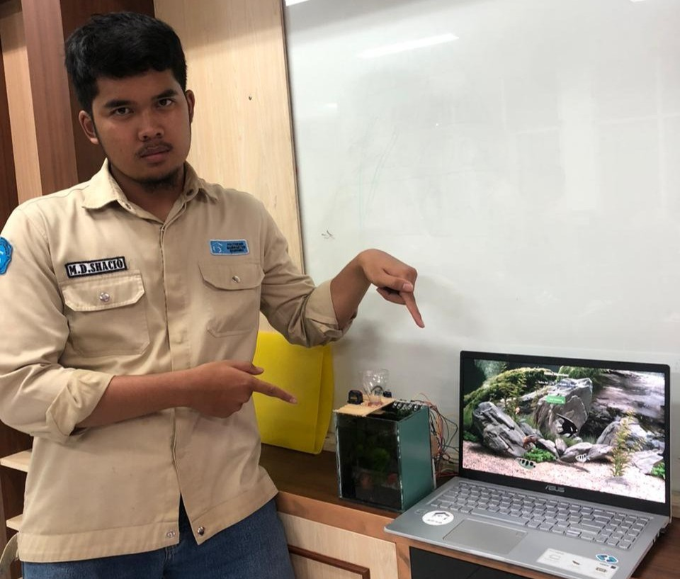

<<<<<<< HEAD
<<<<<<< HEAD
# Portfolio Responsive Complete
## [Watch it on youtube](https://youtu.be/AKNvTxWOdKw)
### Portfolio Responsive Complete
=======
# 🌐 Muhammad Dirgam Shacio — Personal Portfolio
>>>>>>> 8f1ba62d7717e1139c5cb5ea8da212705c74e150

Selamat datang di repository portofolio saya!  
Website ini dibuat untuk menampilkan profil, pengalaman, dan keterampilan saya di bidang **Machine Learning**, **Internet of Things (IoT)**, dan **Web Development**.

## 🚀 Tentang Proyek Ini

Website portofolio ini merupakan proyek statis yang dibangun menggunakan:
- **HTML5**
- **CSS3**
- **Vanilla JavaScript**
- **Boxicons** untuk ikon
- Desain **responsive** dan **modern minimalis**

<<<<<<< HEAD
=======
# PORTOFOLIOWEBSITE
this is my portofolio website
>>>>>>> 20f1f4e50825f7be7d27da1f357502d867d1c924
=======
Tujuannya adalah menampilkan identitas profesional saya serta memberikan gambaran tentang keahlian yang saya miliki.

## 🧠 Tentang Saya

Saya adalah **Muhammad Dirgam Shacio**, seorang pengembang yang fokus pada:
- 🧩 **Machine Learning Engineering** — membangun model prediktif dan analitik berbasis data.  
- 🌐 **Web Development** — membuat aplikasi web modern yang efisien dan elegan.  
- 🤖 **Internet of Things (IoT)** — menghubungkan perangkat fisik ke dunia digital.  

Saya percaya bahwa teknologi adalah sarana untuk menciptakan solusi nyata dan berdampak bagi masyarakat.

## ⚙️ Fitur Website
- ✨ Desain responsif & elegan
- 💼 Section “About”, “Skills”, dan “Projects”
- 🧾 Navigasi dinamis dengan efek animasi halus
- 📱 Tampilan ramah untuk mobile & desktop

## 📸 Preview
Tampilan website:


> Demo langsung: *(tambahkan link GitHub Pages atau domain kamu di sini)*  
> Contoh: [https://muhammaddirgamshacio.github.io/](https://muhammaddirgamshacio.github.io/)

## 🛠️ Cara Menjalankan Secara Lokal
1. Clone repository ini:
   ```bash
   git clone https://github.com/muhammaddirgamshacio/portfolio.git
>>>>>>> 8f1ba62d7717e1139c5cb5ea8da212705c74e150
